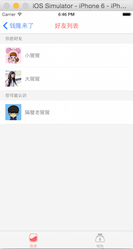

# react-native-demo
 


## 使用

##### 安装依赖模块
```
	$ npm install
```

##### 启动模拟接口服务
```
	$ cd server
	$ npm install
	$ node server.js
```

## 开发
- [Git 使用](https://github.com/beefe/qianlong/blob/master/doc/learn-git.md)

## Todos

- 调整目录结构，优化代码

## 遇到的问题

##### 没有提供canvas和svg画图接口，实现图表需求比较困难。
- 内嵌一个webview来画如何了？


